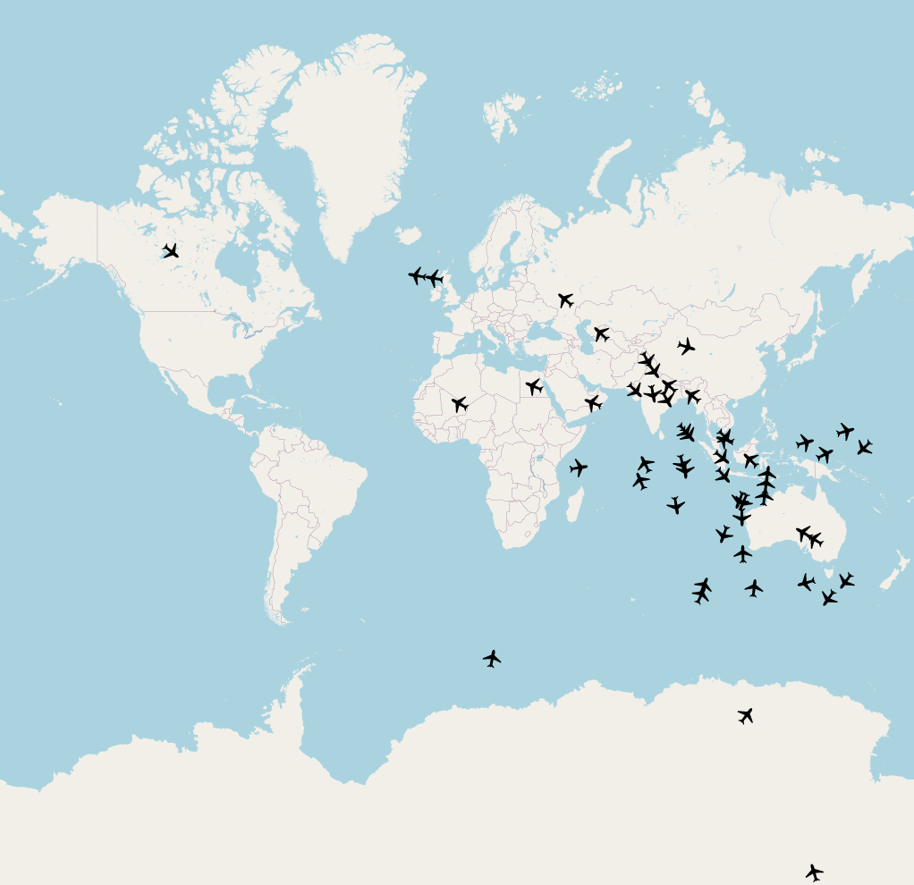
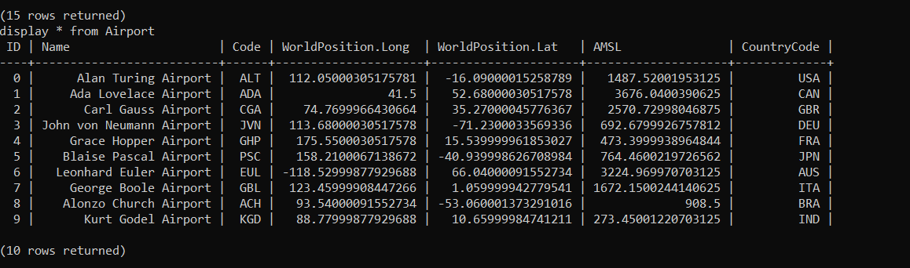

# FlightTracker:

To repozytorium zawiera projekt FlightTracker, który został zrealizowany w ramach przedmiotu "Projektowanie Obiektowe" podczas letniego semestru roku akademickiego 2023-2024.

FlightTracker to konsolowo-okienkowy program, symulujący śledzenie lotów w czasie rzeczywistym.
Aplikacja umożliwia użytkownikom monitorowania statusu lotów na całym świecie.

  

Część konsolowa programu obsługuje następujące komendy:

- `open`, która otwiera okno graficzne, wyświetlające pozycje samolotów zapisanych w bazie danych na mapie świata.
- `exit`, która kończy działanie aplikacji pod warunkiem, że okno graficzne wyświetlające pozycje samolotów jest zamknięte.
- `print`, która serializuje w formacie JSON zawartość bazy danych do pliku oraz wyświetla statystyki dotyczące serializacji.
- `parse`, która wczytuje do bazy danych obiekty zapisane w określonym formacie w pliku o rozszerzeniu `.ftr`.
- `report`, która wyświetla na konsoli informacje na temat obiektów klas: `Airport`, `CargoPlane` oraz `PassengerPlane`.
- `display`, która wyświetla określoną tabelę z bazy danych. Składnia zapytania `display` jest zbliżona do zapytania `select` z języka SQL.
- `add`, która dodaje obiekt do określonej tabeli bazy danych. Składnia zapytania `add` jest zbliżona do polecenia `insert into` z języka SQL.
- `update`, która modyfikuje wybrane atrybuty istniejącego obiektu bazy danych. Składnia polecenia `update` jest zbliżona do instrukcji `update set` z języka SQL.
- `delete`, która usuwa wybrane obiekty z bazy danych. Składnia polecenia `delete` jest zbliżona do polecenia `delete from` z języka SQL.

  

